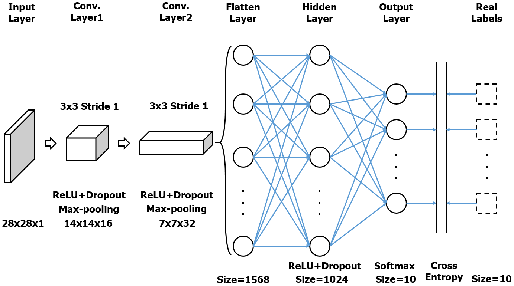
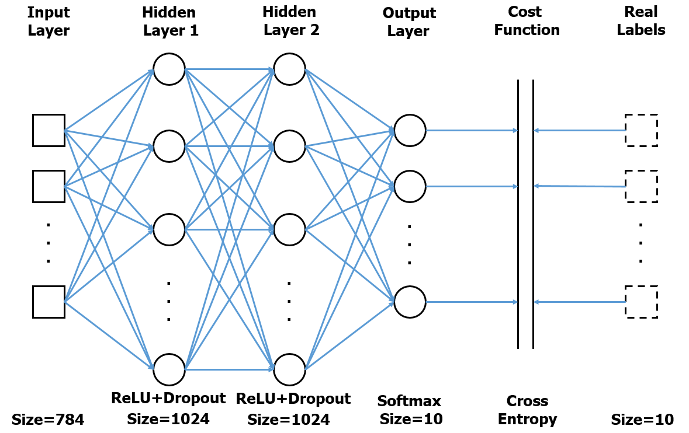
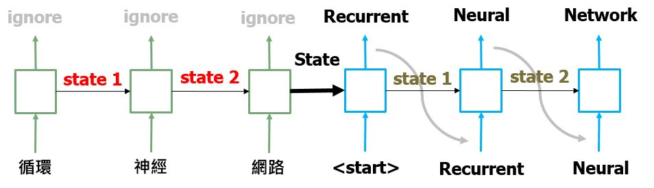

## Simple deep learning tutorials
These are neural network tutorials for NTU BIME lab-301 (2018)

## Requirements:
    - python 3.5
    - tensorflow v1.5
    - sklearn
    - numpy
    - matplotlib.pyplot
 
 
There are some figures to help understanding the network, such as  
 

